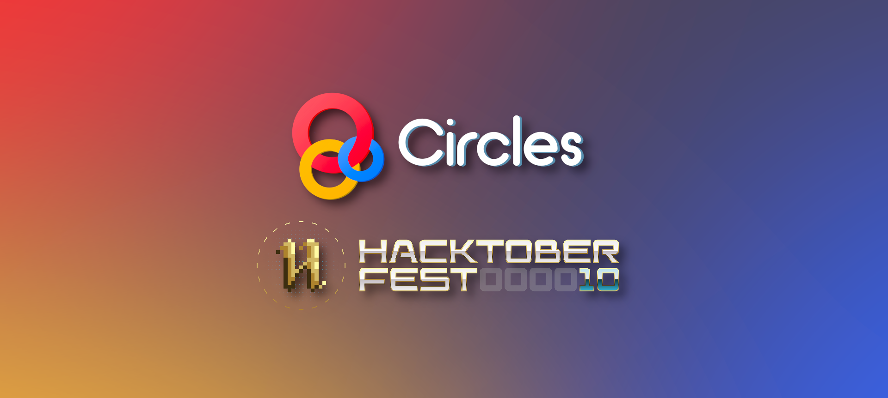
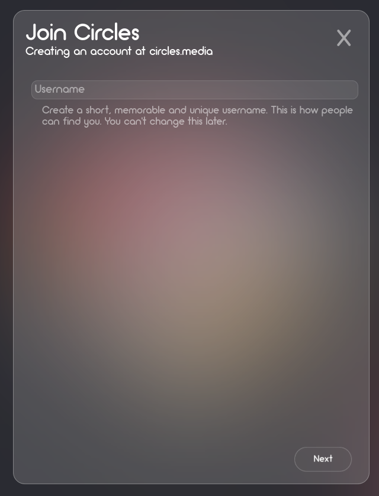
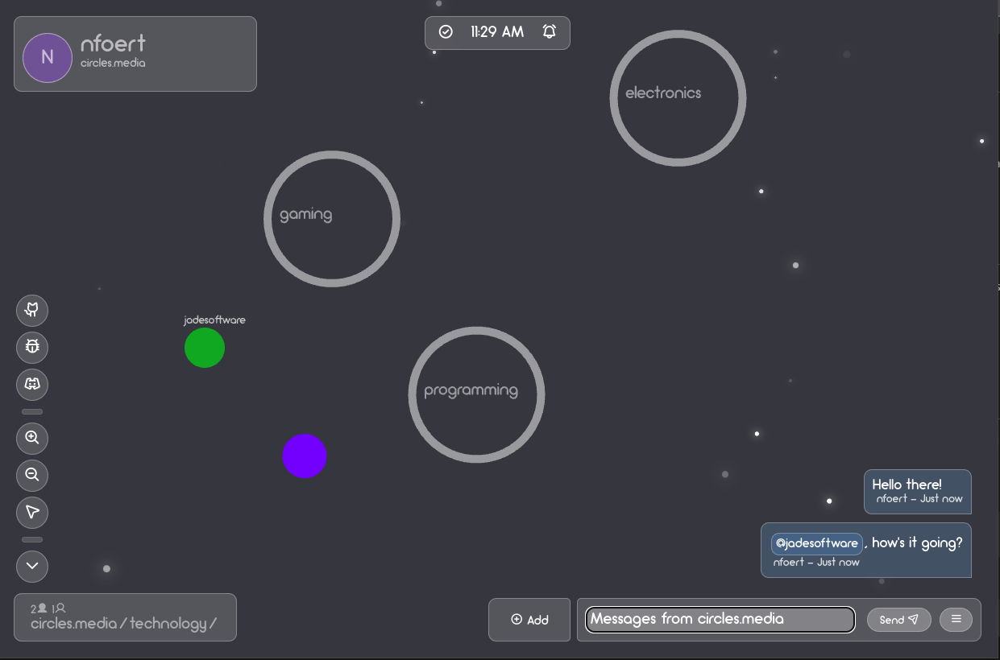

<p align="center">
    
</p>
<hr>
<p align="center"><b>ⵔ Official server & Open Alpha coming soon ⵔ</b></p>
<p align="center">ⵔ <a href="https://discord.com/invite/QBDw4UrGXX">Discord</a> ⵔ <a href="https://twitch.tv/nfoert">Twitch</a> ⵔ <a href="https://youtube.com/@nfoert">YouTube</a> ⵔ</p>

<hr>


<br>

<p align="center"><b>Circles is currently under development. It'll be avaliable to access soon.</b></p>
<br>

<hr>

<br>
<p align="center">Circles is an open source, decentralized social network where people can move within a physical space and interact with each other.</p>
<p align="center">Every User's Account lives within a Server. These Users can create Circles within these Servers, and sub Circles within those. Any other User can move in and out of Public Circles. Users can send messages in the Circle they're in, or in the entire Server. Users can also create Conversations with specific Users.</p>

<hr>

<br>




<br>

# Why
I created Circles for a few reasons: 
- I care a lot about open source and I feel that we need more options for FOSS social media
- Right now, people on social media just feel like users who post stuff. I want Circles to feel like an actual space where people can move and interact, and allow people to have their own ways of expressing themselves.

I have lots of ideas on how to make Circles great and It's going to be a lot of work, but I'm very excited.

# What needs done
I'd love to work with other programmers, artists, designers, and even you. I'd love to see pepole collaborating and contributing to Circles. Here's a rough list of the things that needs done. This list will change and evolve as the project grows.

  - Confirm Password
  - Rules
  - Change Profile Details
    - Password
    - Username
    - Display Name
    - Color
    - Delete Account
  - Basic features (lol)
    - Moving between circles
    - Online users


# Installation
All the self-hosting infrastructure is not fully setup yet. These instructions are not final and will be adjusted as new features and infrastructure are set up. If you're having any problems with any of this please create an Issue.
This is a brief guide.

Clone this repo by running 
```
git clone https://github.com/nfoert/circles
```
Navigate to it using and create a virtual enviroment
```
cd circles
python -m venv <name of venv>
```
Activate the venv using the command for your system and install the necessary packages
(for Windows):
```
source ./<name of venv>/Scripts/activate
pip install -r requirements.txt
```
(for Mac OS):
```
source ./<name of venv>/bin/activate
pip install -r requirements.txt
```
(for Linux):
```
source ./<name of venv>/bin/activate
pip install -r requirements.txt
```
<br>

Next, make and migrate your migrations, then create a superuser.
Before doing this, delete the `migrations` folders from the `main` and `authentication` folders. Then run the following commands:
```
cd circles
python manage.py makemigrations main authentication
python manage.py migrate
python manage.py createsuperuser
```

**Note**: If you get an error when creating your superuser (`Superuser creation skipped due to not running in a TTY`) use this command instead:
```
winpty python manage.py createsuperuser
``` 

Now, run the server so you can do some inital setup
```
python manage.py runserver
```
Navigate to `http://127.0.0.1:8000/admin` in your browser. Log in using the credentials for your new super user and find the server info section. Configure the ip to be `http://127.0.0.1:8000` and the server name to be whatever you like. I reccomend making the name what you're planning on your domain to be.

Everything *should* be working. Locally at least.

If you're doing this on a production server you should either follow the steps as above again, or if you're wanting to customize your own server fork this repo and repeat the steps above with your own GitHub repo url.

**Warning: The `SECRET_KEY` in `settings.py` is insecure! Ensure to change this and do any steps in `python manage.py check --deploy` when using this in production.**

Additional setup may be required on specific hosting providers to be able to find things like static or media files.

On my production server I also have to run `python manage.py collectstatic` to get updated static files to be served to the client correctly.

# Contributing
Here's a brief explanation on how to contribute if you're new here.
1. Press the `Fork Repo` button. This creates a copy of the repo for you to edit.
2. Run the `git clone https://<username>/<name of forked repo>` command on your computer to download the files for you to edit
3. Create a virtual enviroment with `python -m venv <name of venv>` and activate it with the command for your system.
4. Install the required packages with `pip install -r requirements.txt`
5. Move to the directory using `cd circles`
6. Migrate changes using `python manage.py makemigrations && python manage.py migrate`
7. Run the server using `python manage.py runserver` (Or if you're using vscode, use the included task in `tasks.json`)
8. Make changes to the project.
9. Commit your changes to your fork
10. On the GitHub page for your fork, press the `Contribute` button. Select the branch and commits to merge.
11. Write comments about what you changed in the project.
12. Create your pull request. I'll review the changes and make necessary adjustments before approving your changes.
13. Thank you! <3


# Hacktoberfest
Circles is proud to be a part of hacktoberfest 2023! I'd love to see some people contributing to Circles, and I'll also be contributing to other open source projects during Hacktoberfest.

If you're not sure what Hacktoberfest is, It's an celebration of open source software. It teaches users the power of open source, how to use source control and how to contribute to open source projects. The internet is powered by open source, and contibuting and celebrating that and the people behind it is what Hacktoberfest is all about.

Circles is a very new project, and there's lots of things to be done. If you have any skills to help get some of the things on the above list finished, or just want to help clean up some code, I'd appreciate it.

You can learn more about Hacktoberfest [here](https://hacktoberfest.com/).
